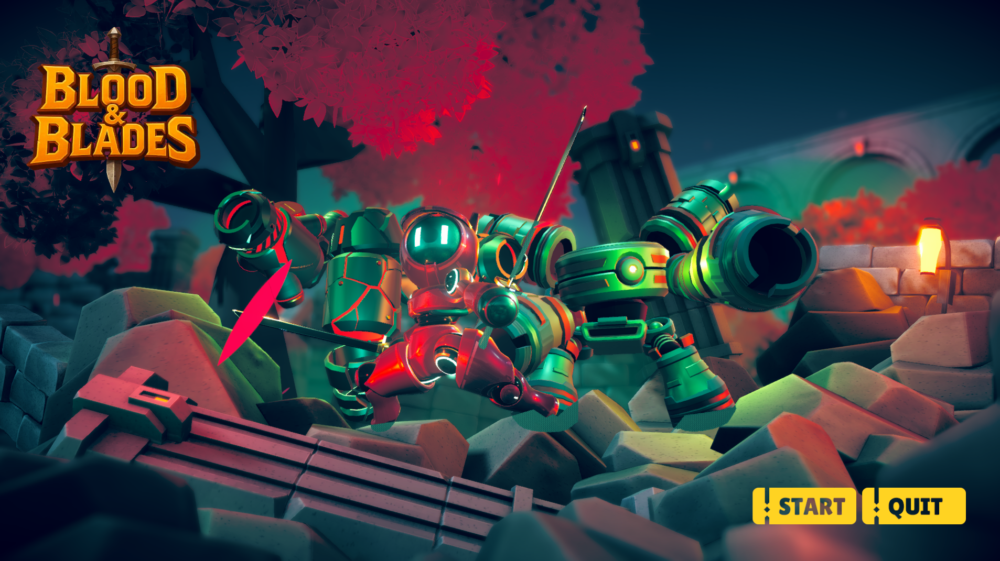

# blood-and-blades

# 🗡️ Blood & Blades

**Blood & Blades** is a 3D action–adventure game developed in Unity.  
The player takes on the role of a knight whose main mission is to free an occupied castle from enemies.  



---

## 🎮 Game Description

In **Blood & Blades**, the player moves through different levels inside the castle.  
At each level, the player must:

- Defeat all enemies  
- Complete the given mission  
- Activate the portal to the next level  

On the final level, the player faces the **main boss** who has taken over the castle.  
By defeating him – the castle is liberated.  

---

## ⚔️ Gameplay Mechanics

- **Movement:** WASD for movement, Space for sliding  
- **Combat:** Left click to attack, triple left click for a dash  
- **Inventory:** System for collecting coins and purchasing equipment  
- **Level progression:** Portal unlocks only after completing the mission on the level  

---

## 💰 Reward System

- **Heal orbs** drop from defeated enemies and restore the player’s health  
- After progressing to the next level, the player receives a new sword with higher stats  

---

## 🛠️ Technologies & Tools

- **Game engine:** Unity (C#)  
- **3D models:** Blender / Asset Store  
- **Audio:** Unity Audio System  
- **Version control:** Git & GitHub
- 
---

- ## 🚀 How to Run the Game

1. Clone the repository:  
   ```bash
   git clone https://github.com/username/blood-and-blades.git
2. Open the project in Unity Hub (version e.g. 2022.3 LTS)
3. Launch the MainMenu scene and click Play
